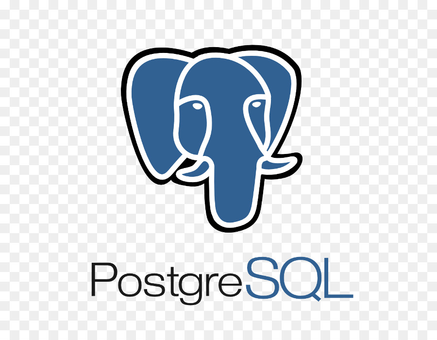
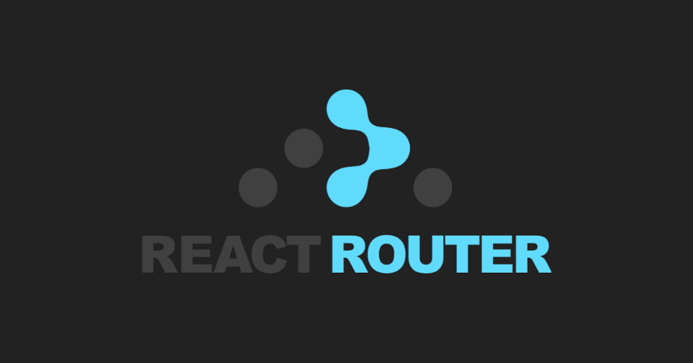

I'm romuald, I've a developer web & web mobile professional title and I'm actually in formation for to become application designer developer.

I had already work on collaborative project using an agile method.

*__I've already work  whith__* : 

*Languages :* 

<table width=100" align="center">
  <tr>
    <th width='150'>
       
    </th>
    <th width="150">
       
    </th>
        <th width='150'>
       
    </th>
     </th>
        <th width='150'>
       
    </th>
  </tr>
  <tr>
    <th colspan="2" align="center">
      
    </td>
   </th>
    <th width='150'>
       
    </th>
     <th width='150'>
       
    </th>
  </tr>
</table>

                                                     
                                                     
                                                     
*technologies :*

<table width=100" align="center">
  <tr>
    <th width='150'>
       
    </th>
    <th width="150">
       
    </th>
        <th width='150'>
       
    </th>
     </th>
        <th width='150'>
       
    </th>
  </tr>
  <tr>
    <th colspan="2" align="center">
      
    </td>
   </th>
    <th width='300' colspan="2">
       
    
  </tr>
</table>                                                    
                                                     
  
 
  
                                                 

        
                                                     
